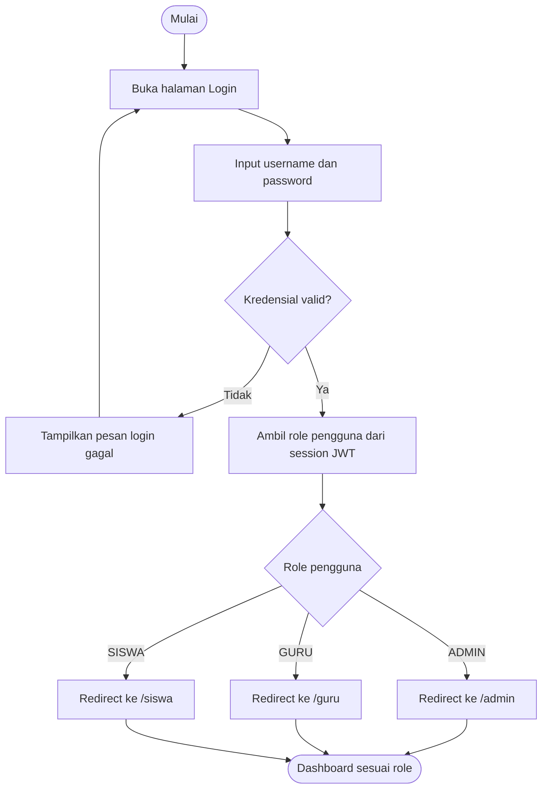
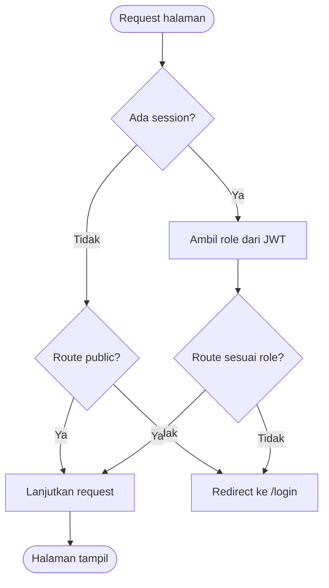
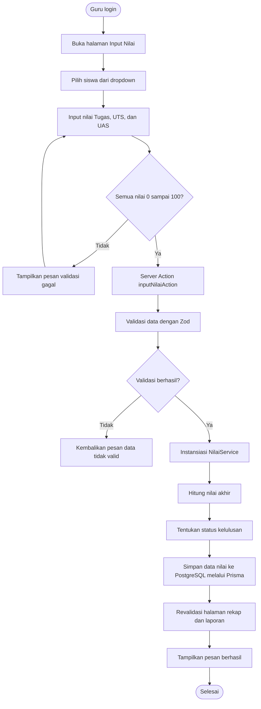
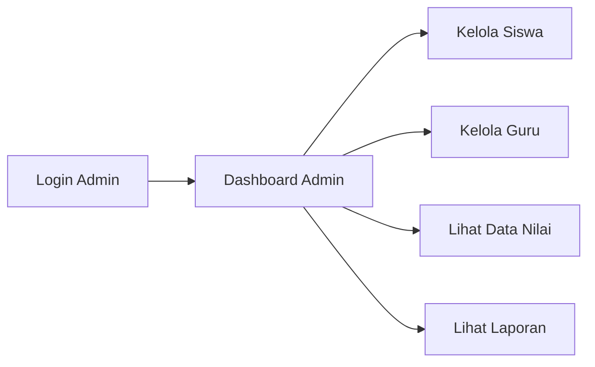
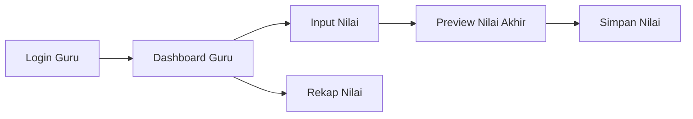
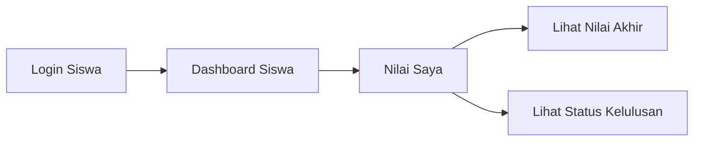

# Flowchart dan Alur Kerja

Dokumen ini menjelaskan alur kerja utama sistem menggunakan diagram Mermaid agar dapat langsung dirender oleh Markdown viewer yang mendukung Mermaid.

## 1. Flowchart Login dan Redirect Role



Penjelasan:

1. Pengguna membuka halaman `/login`.
2. Pengguna mengisi username dan password.
3. Sistem memvalidasi kredensial menggunakan NextAuth.js Credentials Provider.
4. Jika tidak valid, sistem menampilkan pesan gagal.
5. Jika valid, sistem membaca role dari session/JWT.
6. Sistem mengarahkan pengguna ke dashboard sesuai role.

## 2. Flowchart Proteksi Route Middleware



Penjelasan:

Middleware menjaga route `/admin`, `/guru`, dan `/siswa`. Pengguna tanpa session diarahkan ke `/login`. Pengguna dengan role yang tidak sesuai juga diarahkan kembali ke halaman login.

## 3. Flowchart Input Nilai Hingga Status Kelulusan



Formula yang digunakan:

```text
Nilai Akhir = (0.3 x Tugas) + (0.3 x UTS) + (0.4 x UAS)
```

Aturan kelulusan:

```text
Nilai Akhir >= 70  => LULUS
Nilai Akhir < 70   => TIDAK_LULUS
```

## 4. Alur Kerja Berdasarkan Aktor

### 4.1 Admin



### 4.2 Guru



### 4.3 Siswa



## 5. Catatan Desain Alur

1. Semua operasi database dilakukan melalui Prisma.
2. Semua operasi CRUD dari form melewati Server Action.
3. Server Action memanggil class service agar bukti OOP terlihat jelas.
4. Formula nilai menggunakan fungsi/method yang terpusat agar tidak terjadi duplikasi logika.

