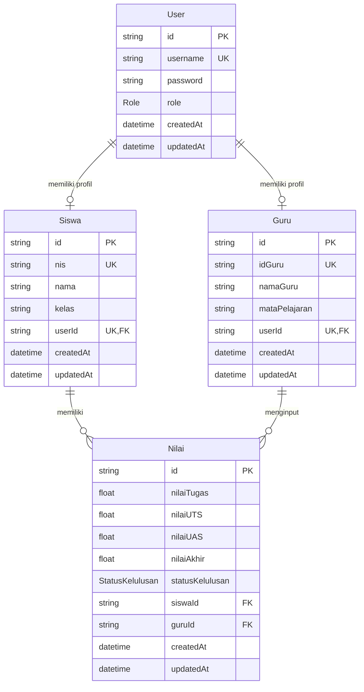

# Rancangan Database

## 1. Tujuan Rancangan Database

Database dirancang untuk menyimpan data pengguna, siswa, guru, dan nilai. Sistem menggunakan PostgreSQL dengan Prisma ORM agar akses database aman, terstruktur, dan mudah dirawat.

## 2. Entitas Utama

Entitas utama dalam sistem:

1. `User`
2. `Siswa`
3. `Guru`
4. `Nilai`

Enum pendukung:

1. `Role`
2. `StatusKelulusan`

## 3. Diagram Relasi Database



## 4. Tabel User

Tabel `User` digunakan untuk autentikasi semua aktor sistem.

| Field | Tipe | Keterangan |
| --- | --- | --- |
| `id` | String | Primary key dengan format cuid. |
| `username` | String | Username unik untuk login. |
| `password` | String | Password yang sudah di-hash dengan bcryptjs. |
| `role` | Role | Role pengguna: ADMIN, GURU, atau SISWA. |
| `createdAt` | DateTime | Waktu data dibuat. |
| `updatedAt` | DateTime | Waktu data terakhir diperbarui. |

Relasi:

- Satu `User` dapat berelasi dengan satu `Siswa`.
- Satu `User` dapat berelasi dengan satu `Guru`.
- Admin hanya tersimpan sebagai `User` dengan role ADMIN tanpa profil `Siswa` atau `Guru`.

## 5. Tabel Siswa

Tabel `Siswa` menyimpan data profil siswa.

| Field | Tipe | Keterangan |
| --- | --- | --- |
| `id` | String | Primary key. |
| `nis` | String | Nomor Induk Siswa, wajib unik. |
| `nama` | String | Nama lengkap siswa. |
| `kelas` | String | Kelas siswa. |
| `userId` | String | Foreign key ke tabel User, wajib unik. |
| `createdAt` | DateTime | Waktu data dibuat. |
| `updatedAt` | DateTime | Waktu data terakhir diperbarui. |

Relasi:

- `Siswa` memiliki relasi one-to-one dengan `User`.
- `Siswa` memiliki relasi one-to-many dengan `Nilai`.
- Jika `User` dihapus, data `Siswa` ikut terhapus melalui cascade delete.

## 6. Tabel Guru

Tabel `Guru` menyimpan data profil guru.

| Field | Tipe | Keterangan |
| --- | --- | --- |
| `id` | String | Primary key. |
| `idGuru` | String | ID guru, wajib unik. |
| `namaGuru` | String | Nama lengkap guru. |
| `mataPelajaran` | String | Mata pelajaran yang diampu. |
| `userId` | String | Foreign key ke tabel User, wajib unik. |
| `createdAt` | DateTime | Waktu data dibuat. |
| `updatedAt` | DateTime | Waktu data terakhir diperbarui. |

Relasi:

- `Guru` memiliki relasi one-to-one dengan `User`.
- `Guru` memiliki relasi one-to-many dengan `Nilai`.
- Satu guru hanya mengampu satu mata pelajaran.
- Jika `User` dihapus, data `Guru` ikut terhapus melalui cascade delete.

## 7. Tabel Nilai

Tabel `Nilai` menyimpan hasil penilaian siswa untuk satu guru/mata pelajaran.

| Field | Tipe | Keterangan |
| --- | --- | --- |
| `id` | String | Primary key. |
| `nilaiTugas` | Float | Nilai tugas dengan rentang 0 sampai 100. |
| `nilaiUTS` | Float | Nilai UTS dengan rentang 0 sampai 100. |
| `nilaiUAS` | Float | Nilai UAS dengan rentang 0 sampai 100. |
| `nilaiAkhir` | Float | Hasil perhitungan otomatis. |
| `statusKelulusan` | StatusKelulusan | LULUS atau TIDAK_LULUS. |
| `siswaId` | String | Foreign key ke tabel Siswa. |
| `guruId` | String | Foreign key ke tabel Guru. |
| `createdAt` | DateTime | Waktu data dibuat. |
| `updatedAt` | DateTime | Waktu data terakhir diperbarui. |

Constraint penting:

```text
@@unique([siswaId, guruId])
```

Artinya, satu siswa hanya boleh memiliki satu data nilai untuk satu guru/mata pelajaran yang sama.

## 8. Enum Role

```text
ADMIN
GURU
SISWA
```

Enum ini digunakan untuk menentukan hak akses pengguna.

## 9. Enum StatusKelulusan

```text
LULUS
TIDAK_LULUS
```

Enum ini digunakan untuk menyimpan hasil kelulusan berdasarkan nilai akhir.

## 10. Aturan Integritas Data

1. Username harus unik.
2. NIS siswa harus unik.
3. ID Guru harus unik.
4. Satu akun user hanya boleh terhubung ke satu profil siswa atau satu profil guru.
5. Nilai siswa harus memiliki relasi valid ke `Siswa` dan `Guru`.
6. Nilai akhir tidak diinput manual, tetapi dihitung oleh sistem.
7. Status kelulusan tidak diinput manual, tetapi ditentukan oleh sistem.

