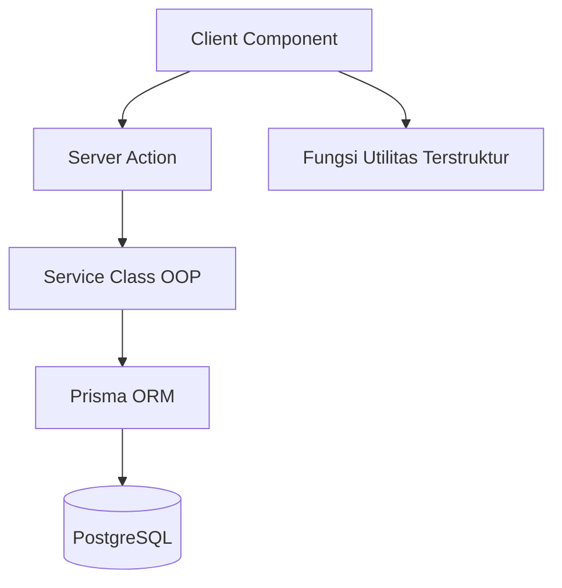
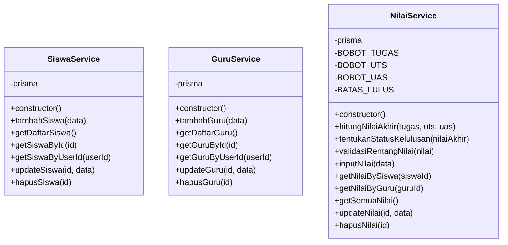
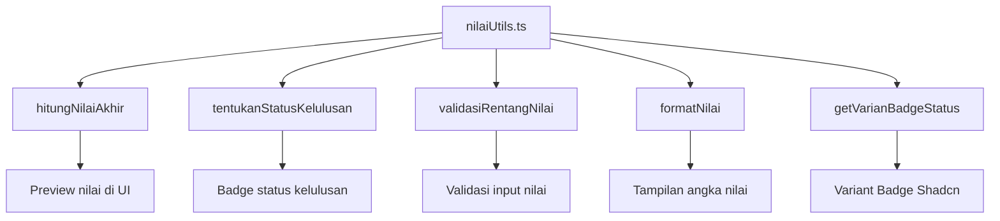

# Rancangan OOP dan Terstruktur

## 1. Tujuan Rancangan

Sistem dirancang untuk menunjukkan dua kompetensi utama dalam UJIKOM LSP Programmer:

1. **Pemrograman Berorientasi Objek (OOP)** melalui class service di `lib/services/`.
2. **Pemrograman Terstruktur** melalui fungsi utilitas di `lib/utils/nilaiUtils.ts`.

Pemisahan ini membuat sistem lebih mudah diuji, dirawat, dan dijelaskan kepada Asesor.

## 2. Arsitektur Eksekusi

Penjelasan:

1. Client Component menangani interaksi pengguna.
2. Server Action menerima input dari form dan melakukan validasi.
3. Server Action menginstansiasi class service dengan `new ServiceClass()`.
4. Service class menjalankan logika bisnis dan query Prisma.
5. Prisma mengakses PostgreSQL.
6. Fungsi utilitas digunakan untuk kalkulasi/format tampilan yang dapat dipakai ulang.

## 3. Rancangan Class OOP

### 3.1 SiswaService

File: `lib/services/SiswaService.ts`

Tujuan: mengelola seluruh operasi yang berkaitan dengan data siswa.

Karakter OOP:

- Menggunakan class `SiswaService`.
- Memiliki constructor.
- Mengenkapsulasi akses database melalui property private `prisma`.
- Method memiliki tanggung jawab spesifik.

Daftar method:

| Method | Fungsi |
| --- | --- |
| `tambahSiswa(data)` | Menambah siswa sekaligus membuat akun User role SISWA. |
| `getDaftarSiswa()` | Mengambil seluruh data siswa beserta user. |
| `getSiswaById(id)` | Mengambil detail siswa berdasarkan ID. |
| `getSiswaByUserId(userId)` | Mengambil siswa berdasarkan user yang sedang login. |
| `updateSiswa(id, data)` | Memperbarui data siswa. |
| `hapusSiswa(id)` | Menghapus data siswa. |

### 3.2 GuruService

File: `lib/services/GuruService.ts`

Tujuan: mengelola seluruh operasi yang berkaitan dengan data guru.

Karakter OOP:

- Menggunakan class `GuruService`.
- Memiliki constructor.
- Mengenkapsulasi akses Prisma dalam class.
- Mengelola data guru dan akun user terkait.

Daftar method:

| Method | Fungsi |
| --- | --- |
| `tambahGuru(data)` | Menambah guru sekaligus membuat akun User role GURU. |
| `getDaftarGuru()` | Mengambil seluruh data guru. |
| `getGuruById(id)` | Mengambil detail guru berdasarkan ID. |
| `getGuruByUserId(userId)` | Mengambil guru berdasarkan user login. |
| `updateGuru(id, data)` | Memperbarui data guru. |
| `hapusGuru(id)` | Menghapus data guru. |

### 3.3 NilaiService

File: `lib/services/NilaiService.ts`

Tujuan: mengelola logika bisnis pengolahan nilai siswa.

Karakter OOP:

- Menggunakan class `NilaiService`.
- Memiliki constructor.
- Memiliki property private dan readonly untuk konstanta bisnis.
- Menggabungkan method kalkulasi nilai dan operasi database.

Konstanta bisnis:

| Konstanta | Nilai | Keterangan |
| --- | --- | --- |
| `BOBOT_TUGAS` | 0.3 | Bobot nilai tugas. |
| `BOBOT_UTS` | 0.3 | Bobot nilai UTS. |
| `BOBOT_UAS` | 0.4 | Bobot nilai UAS. |
| `BATAS_LULUS` | 70 | Ambang batas kelulusan. |

Daftar method:

| Method | Fungsi |
| --- | --- |
| `hitungNilaiAkhir(tugas, uts, uas)` | Menghitung nilai akhir. |
| `tentukanStatusKelulusan(nilaiAkhir)` | Menentukan LULUS atau TIDAK_LULUS. |
| `validasiRentangNilai(nilai)` | Memastikan nilai berada pada 0 sampai 100. |
| `inputNilai(data)` | Menyimpan nilai baru. |
| `getNilaiBySiswa(siswaId)` | Mengambil nilai milik satu siswa. |
| `getNilaiByGuru(guruId)` | Mengambil nilai yang diinput satu guru. |
| `getSemuaNilai()` | Mengambil seluruh nilai untuk Admin/laporan. |
| `updateNilai(id, data)` | Memperbarui nilai dan menghitung ulang nilai akhir. |
| `hapusNilai(id)` | Menghapus data nilai. |

## 4. Diagram Class

## 5. Rancangan Pemrograman Terstruktur

File: `lib/utils/nilaiUtils.ts`

Fungsi utilitas dibuat terpisah agar logika perhitungan nilai dapat digunakan ulang dan tidak ditulis inline di komponen UI.

Daftar fungsi:

| Fungsi | Input | Output | Tujuan |
| --- | --- | --- | --- |
| `hitungNilaiAkhir(nilaiTugas, nilaiUTS, nilaiUAS)` | number, number, number | number | Menghitung nilai akhir dengan bobot 30/30/40. |
| `tentukanStatusKelulusan(nilaiAkhir)` | number | `"LULUS"` atau `"TIDAK_LULUS"` | Menentukan status kelulusan. |
| `validasiRentangNilai(nilai)` | number | boolean | Mengecek nilai 0 sampai 100. |
| `formatNilai(nilai)` | number | string | Memformat nilai untuk tampilan UI. |
| `getVarianBadgeStatus(status)` | string | `"default"` atau `"destructive"` | Menentukan varian badge status. |

## 6. Diagram Fungsi Terstruktur

## 7. Alasan Desain

1. Service class membuat logika backend lebih rapi dan memenuhi bukti OOP.
2. Fungsi utilitas membuat logika nilai lebih mudah diuji dan digunakan ulang.
3. Server Action menjadi penghubung antara UI dan service.
4. Prisma tetap menjadi satu-satunya akses database.
5. Struktur ini memudahkan demonstrasi kepada Asesor karena alur tanggung jawab setiap file jelas.

