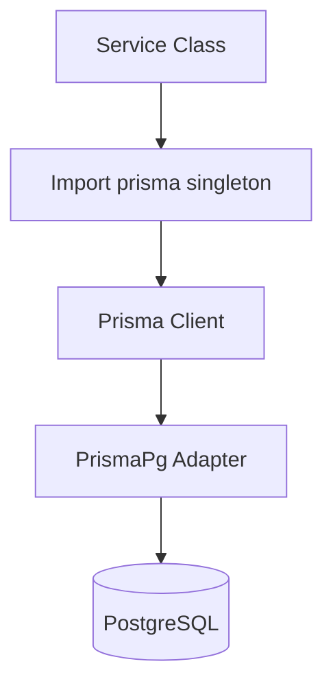

# Koneksi dan Pengujian Database

Dokumen ini membuktikan output 5, yaitu implementasi koneksi database menggunakan Prisma ORM dan PostgreSQL.

## Output 5 - Koneksi Database

Sistem menggunakan PostgreSQL sebagai database utama. Koneksi dilakukan melalui Prisma Client dengan adapter PostgreSQL `@prisma/adapter-pg`.

Pola koneksi yang digunakan adalah **Singleton Prisma Client**. Pola ini penting agar saat development dengan hot reload, aplikasi tidak membuat banyak instance Prisma Client yang dapat membebani koneksi database.

## Bukti Kode Singleton Prisma

Potongan kode asli dari `lib/prisma.ts`:

```ts
import { PrismaClient } from "@prisma/client";
import { PrismaPg } from "@prisma/adapter-pg";

const globalForPrisma = globalThis as unknown as {
  prisma: PrismaClient | undefined;
};

function createPrismaClient(): PrismaClient {
  const connectionString = process.env.DATABASE_URL;
  if (!connectionString) throw new Error("DATABASE_URL is not defined.");
  const adapter = new PrismaPg({ connectionString });
  return new PrismaClient({ adapter });
}

export const prisma: PrismaClient =
  globalForPrisma.prisma ?? createPrismaClient();
if (process.env.NODE_ENV !== "production") globalForPrisma.prisma = prisma;
export default prisma;
```

## Penjelasan Kode

| Bagian | Fungsi |
| --- | --- |
| `PrismaClient` | Client ORM untuk melakukan query database. |
| `PrismaPg` | Adapter PostgreSQL untuk Prisma versi terbaru. |
| `process.env.DATABASE_URL` | Membaca connection string PostgreSQL dari file `.env`. |
| `globalForPrisma.prisma` | Menyimpan instance Prisma secara global saat development. |
| `createPrismaClient()` | Membuat Prisma Client baru jika belum ada instance. |
| `export default prisma` | Mengekspor singleton agar dipakai oleh seluruh service. |

## Bukti Koneksi ke PostgreSQL

Koneksi dinyatakan berhasil karena:

1. Prisma Client berhasil dibuat menggunakan `DATABASE_URL`.
2. Service layer dapat menjalankan query melalui singleton `prisma`.
3. Data seed berhasil digunakan untuk akun Admin, Guru, dan Siswa.
4. Fitur CRUD siswa, CRUD guru, input nilai, rekap nilai, dan nilai siswa berjalan menggunakan data PostgreSQL.

## Alur Koneksi Database



## Contoh Pemakaian Prisma di Service

Potongan kode asli dari `lib/services/NilaiService.ts`:

```ts
constructor() {
  this.prisma = prisma;
}

async getNilaiByGuru(guruId: string): Promise<NilaiGuru[]> {
  return await this.prisma.nilai.findMany({
    where: { guruId },
    include: { siswa: true },
    orderBy: { createdAt: "desc" },
  });
}
```

Penjelasan:

1. Service tidak membuat `new PrismaClient()` sendiri.
2. Service memakai singleton dari `lib/prisma.ts`.
3. Query Prisma menggunakan relasi yang dibutuhkan UI, seperti `include: { siswa: true }`.

## Kesimpulan

Output koneksi database telah terpenuhi. Aplikasi menggunakan Prisma ORM dengan PostgreSQL secara terstruktur, aman, dan konsisten melalui pola Singleton Prisma Client.

