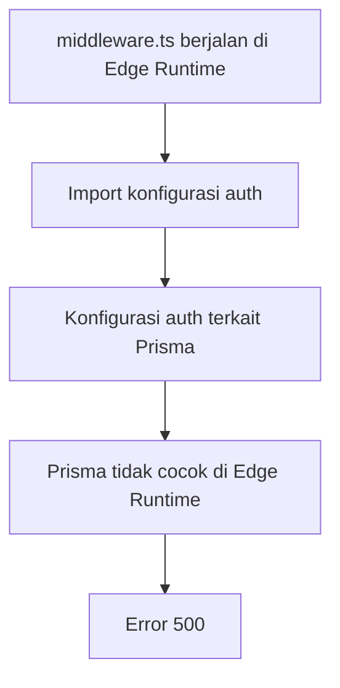

# Catatan Debugging dan Perbaikan

Dokumen ini membuktikan output 6 dan 7, yaitu kemampuan melakukan debugging dan memperbaiki masalah teknis selama implementasi program.

## Output 6 - Debugging Error 500 NextAuth Edge Runtime

### Masalah

Pada tahap awal implementasi middleware autentikasi, terjadi masalah Error 500 ketika route terproteksi diakses. Penyebab teknisnya adalah middleware Next.js berjalan di **Edge Runtime**, sedangkan konfigurasi autentikasi yang diimpor dapat membawa dependency database seperti Prisma.

Prisma Client tidak cocok dijalankan langsung di middleware Edge Runtime. Akibatnya, middleware berpotensi gagal saat memproses proteksi route.

### Akar Masalah

Alur masalah:



### Perbaikan

Perbaikan dilakukan dengan membaca JWT langsung menggunakan `next-auth/jwt`, tanpa mengimpor Prisma atau konfigurasi auth yang memuat akses database.

Potongan kode asli dari `middleware.ts`:

```ts
import { getToken } from "next-auth/jwt";
import type { NextRequest } from "next/server";
import { NextResponse } from "next/server";

const authSecret =
  process.env.AUTH_SECRET ??
  process.env.NEXTAUTH_SECRET ??
  (process.env.NODE_ENV === "production"
    ? undefined
    : "development-secret-aplikasi-nilai-lsp");

export default async function middleware(req: NextRequest) {
  const { nextUrl } = req;
  const token = await getToken({ req, secret: authSecret });
  const isLoggedIn = Boolean(token);
  const role = token?.role;
```

Potongan proteksi role:

```ts
if (!isLoggedIn && nextUrl.pathname !== "/login") {
  return NextResponse.redirect(new URL("/login", nextUrl));
}

if (isLoggedIn && nextUrl.pathname === "/login") {
  const dashboardUrl =
    role === "ADMIN" ? "/admin" : role === "GURU" ? "/guru" : "/siswa";
  return NextResponse.redirect(new URL(dashboardUrl, nextUrl));
}

if (nextUrl.pathname.startsWith("/admin") && role !== "ADMIN") {
  return NextResponse.redirect(new URL("/login", nextUrl));
}
```

### Hasil Perbaikan

| Area | Hasil |
| --- | --- |
| Middleware Edge Runtime | Tidak lagi mengimpor Prisma |
| Proteksi `/admin` | Berjalan berdasarkan role ADMIN |
| Proteksi `/guru` | Berjalan berdasarkan role GURU |
| Proteksi `/siswa` | Berjalan berdasarkan role SISWA |
| Error 500 | Teratasi |

## Output 7 - Debugging Bug Redirect Server Action NEXT_REDIRECT

### Masalah

Pada Server Action login, proses redirect Next.js menghasilkan error internal `NEXT_REDIRECT`. Error ini merupakan mekanisme normal Next.js untuk melakukan redirect, bukan error aplikasi biasa.

Masalah terjadi ketika redirect tersebut masuk ke blok `try-catch`. Jika tidak ditangani dengan benar, error redirect dapat tertangkap sebagai error biasa sehingga URL tertahan di `/login`.

### Perbaikan

Perbaikan dilakukan dengan mendeteksi `isRedirectError(error)` dan melempar ulang error tersebut agar Next.js dapat menyelesaikan proses redirect.

Potongan kode asli dari `actions/authActions.ts`:

```ts
"use server";

import { AuthError } from "next-auth";
import { isRedirectError } from "next/dist/client/components/redirect-error";
import { signIn, signOut } from "@/lib/auth";
import { loginSchema } from "@/lib/validations";
```

Potongan penanganan redirect:

```ts
try {
  await signIn("credentials", {
    username: validasi.data.username,
    password: validasi.data.password,
    redirectTo: "/login",
  });

  return {
    sukses: true,
    pesan: "Login berhasil.",
  };
} catch (error) {
  if (isRedirectError(error)) {
    throw error;
  }

  if (error instanceof AuthError) {
    return {
      sukses: false,
      pesan: "Username atau password tidak sesuai.",
    };
  }

  throw error;
}
```

### Hasil Perbaikan

| Bug | Solusi | Hasil |
| --- | --- | --- |
| URL tertahan di `/login` | `NEXT_REDIRECT` dilempar ulang dengan `isRedirectError` | Redirect berjalan normal |
| Login invalid | `AuthError` ditangani secara khusus | Pesan error tampil jelas |
| Error tidak terduga | Error dilempar ulang | Debugging tetap transparan |

## Kesimpulan

Debugging dilakukan dengan pendekatan yang sesuai runtime:

1. Middleware dibuat ringan dan membaca token melalui `next-auth/jwt`.
2. Prisma tidak digunakan di middleware Edge Runtime.
3. Redirect internal Next.js tidak ditangkap sebagai error biasa.
4. Error autentikasi tetap ditangani dengan pesan yang mudah dipahami pengguna.

