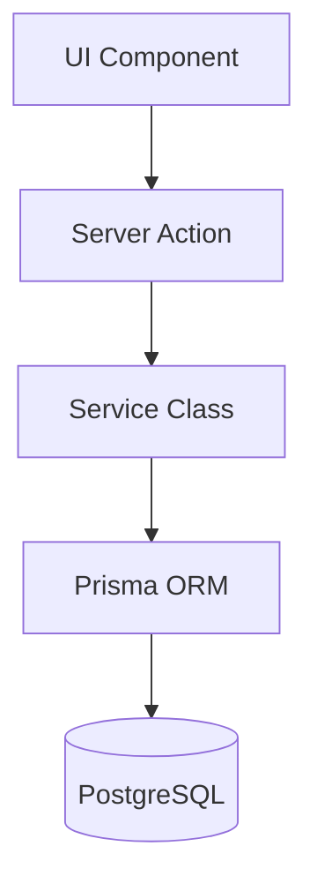

# Panduan Library dan Standar Kode

Dokumen ini membuktikan output 10 dan 11, yaitu pemanfaatan library/framework serta penerapan standar kode.

## Output 10 - Penggunaan Library dan Framework

Berikut library dan framework utama yang digunakan dalam proyek.

| Library/Framework | Fungsi dalam Sistem |
| --- | --- |
| Next.js App Router | Framework utama untuk routing, Server Component, halaman dashboard, dan route handler auth. |
| React 19 | Library UI untuk membangun komponen interaktif. |
| TypeScript | Memberikan typing statis dan meningkatkan keamanan kode. |
| Tailwind CSS v4 | Styling antarmuka responsif dan utility-first. |
| Shadcn UI | Komponen UI seperti Button, Input, Form, Table, Card, Dialog, AlertDialog, Select, dan Badge. |
| Prisma | ORM untuk mengakses PostgreSQL tanpa raw SQL. |
| PostgreSQL | Database utama aplikasi. |
| NextAuth.js v5 | Autentikasi Credentials Provider dan session berbasis JWT. |
| Zod | Validasi input form dan Server Action. |
| bcryptjs | Hash password sebelum disimpan ke database. |
| lucide-react | Ikon antarmuka. |

Potongan dependencies asli dari `package.json`:

```json
"dependencies": {
  "@prisma/adapter-pg": "^7.8.0",
  "@prisma/client": "^7.8.0",
  "bcryptjs": "^3.0.3",
  "lucide-react": "^1.17.0",
  "next": "16.2.7",
  "next-auth": "^5.0.0-beta.31",
  "pg": "^8.21.0",
  "prisma": "^7.8.0",
  "radix-ui": "^1.4.3",
  "react": "19.2.4",
  "react-dom": "19.2.4",
  "shadcn": "^4.10.0",
  "tailwind-merge": "^3.6.0",
  "zod": "^4.4.3"
}
```

## Output 11 - Standar Kode

### 1. TypeScript Strict

Proyek menggunakan TypeScript strict mode.

Potongan kode asli dari `tsconfig.json`:

```json
{
  "compilerOptions": {
    "strict": true,
    "noEmit": true,
    "moduleResolution": "bundler",
    "isolatedModules": true,
    "jsx": "react-jsx"
  }
}
```

Implikasi:

1. Tipe data harus jelas.
2. Risiko `implicit any` ditekan.
3. Return type pada service dan action ditulis eksplisit.

### 2. Pemisahan UI dan Logika Bisnis

Arsitektur aplikasi memisahkan UI, Server Action, Service, dan Database.



Contoh:

1. `components/nilai/FormInputNilai.tsx` menangani UI form.
2. `actions/nilaiActions.ts` menangani validasi dan response action.
3. `lib/services/NilaiService.ts` menangani logika nilai dan query database.
4. `lib/prisma.ts` menangani koneksi database.

### 3. Try-Catch di Server Action

Server Action menggunakan pola try-catch untuk validasi, pemanggilan service, penanganan error Prisma, dan pesan error user-friendly.

Potongan kode asli dari `actions/nilaiActions.ts`:

```ts
export async function inputNilaiAction(data: CreateNilaiInput): Promise<ActionResult> {
  try {
    const validasi = nilaiSchema.safeParse(data);
    if (!validasi.success) {
      return {
        sukses: false,
        pesan: "Data nilai tidak valid. Pastikan semua nilai antara 0-100.",
        error: validasi.error.flatten(),
      };
    }

    const nilaiService = new NilaiService();
    await nilaiService.inputNilai(validasi.data);
    revalidateNilaiPages();

    return { sukses: true, pesan: "Nilai berhasil diinput." };
  } catch (error) {
    if (error instanceof Prisma.PrismaClientKnownRequestError) {
      return { sukses: false, pesan: getPesanErrorPrisma(error) };
    }

    console.error("[inputNilaiAction] Error:", error);
    return { sukses: false, pesan: "Terjadi kesalahan pada server." };
  }
}
```

### 4. Validasi Input dengan Zod

Validasi form dilakukan sebelum data masuk ke service/database.

Contoh dari Server Action:

```ts
const validasi = nilaiSchema.safeParse(data);
if (!validasi.success) {
  return {
    sukses: false,
    pesan: "Data nilai tidak valid. Pastikan semua nilai antara 0-100.",
    error: validasi.error.flatten(),
  };
}
```

### 5. Penanganan Error Prisma

Error Prisma ditangani dengan pesan yang sesuai.

Potongan kode asli:

```ts
function getPesanErrorPrisma(error: Prisma.PrismaClientKnownRequestError): string {
  if (error.code === "P2002") {
    return "Nilai untuk siswa ini pada mata pelajaran ini sudah ada.";
  }
  if (error.code === "P2025") return "Data nilai tidak ditemukan.";
  if (error.code === "P2003") return "Data siswa atau guru tidak valid.";
  return "Terjadi kesalahan database.";
}
```

### 6. Prinsip Clean Code

Standar clean code yang diterapkan:

| Standar | Implementasi |
| --- | --- |
| Naming jelas | Nama seperti `inputNilaiAction`, `hitungNilaiAkhir`, `getNilaiByGuru`. |
| Single Responsibility | UI, action, service, dan utility dipisahkan. |
| DRY | Formula nilai ditempatkan di fungsi/method khusus. |
| Encapsulation | Prisma dan konstanta bisnis dienkapsulasi di service. |
| Error handling | Semua action utama menggunakan try-catch. |
| Type safety | Tipe seperti `CreateNilaiInput`, `ActionResult`, dan `NilaiRow` digunakan eksplisit. |

## Kesimpulan

Output 10 dan 11 telah terpenuhi:

1. Sistem menggunakan library modern sesuai PRD: Next.js, Prisma, PostgreSQL, NextAuth, Zod, Shadcn UI, dan Tailwind CSS.
2. Standar kode mengikuti TypeScript strict, clean architecture, OOP service layer, pemrograman terstruktur, validasi Zod, dan error handling yang konsisten.

