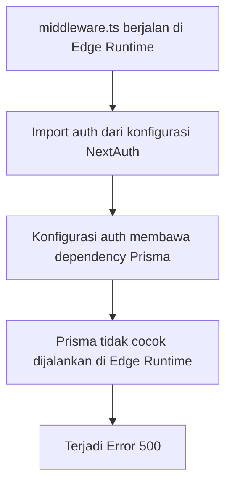
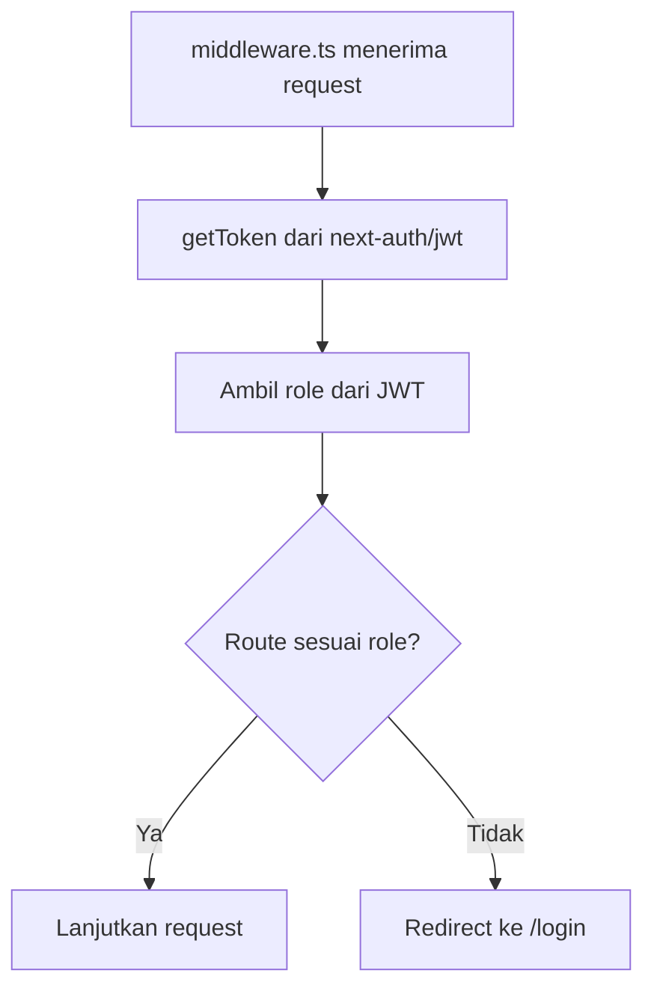

# Dokumentasi Debugging

## 1. Tujuan Dokumentasi

Dokumen ini menjelaskan salah satu proses debugging penting selama pengembangan aplikasi, yaitu masalah pada middleware autentikasi NextAuth.js v5 di lingkungan Edge Runtime.

Dokumentasi ini disusun untuk menunjukkan kemampuan analisis masalah, identifikasi penyebab, dan penerapan solusi yang sesuai.

## 2. Masalah yang Ditemukan

Masalah terjadi pada file:

```text
middleware.ts
```

Gejala:

1. Saat mengakses route terproteksi, aplikasi mengalami Error 500.
2. Middleware tidak dapat memproses session dengan stabil.
3. Proteksi route Admin, Guru, dan Siswa tidak berjalan sebagaimana mestinya.

## 3. Penyebab Teknis

Middleware Next.js berjalan pada **Edge Runtime**. Edge Runtime memiliki batasan tertentu, terutama terhadap module Node.js dan koneksi database.

Masalah muncul ketika middleware menggunakan konfigurasi autentikasi yang secara tidak langsung mengimpor Prisma atau dependency database.

Alur masalah:



Poin utama:

1. Prisma Client tidak boleh dijalankan langsung di middleware Edge.
2. Middleware seharusnya hanya membaca token/session ringan.
3. Query database tidak diperlukan di middleware karena role sudah tersedia di JWT.

## 4. Solusi yang Diterapkan

Solusi yang digunakan adalah memisahkan middleware dari dependency Prisma.

Middleware tidak lagi mengimpor konfigurasi auth yang membawa Prisma. Sebagai gantinya, middleware membaca JWT menggunakan:

```text
next-auth/jwt
```

Dengan pendekatan ini, middleware cukup membaca token dan role pengguna tanpa melakukan query database.

Alur solusi:



## 5. Alasan Solusi Tepat

Solusi ini tepat karena:

1. Middleware tetap ringan dan kompatibel dengan Edge Runtime.
2. Prisma tidak dijalankan di middleware.
3. Role pengguna tetap dapat dibaca dari JWT.
4. Proteksi route tetap berjalan.
5. Arsitektur service OOP tidak terganggu.

## 6. Dampak Perbaikan

Setelah perbaikan:

| Area | Hasil |
| --- | --- |
| Error 500 middleware | Teratasi |
| Proteksi route Admin | Berjalan |
| Proteksi route Guru | Berjalan |
| Proteksi route Siswa | Berjalan |
| Prisma di middleware | Tidak digunakan |
| Arsitektur OOP service | Tetap aman |

## 7. Pelajaran yang Didapat

1. Middleware Next.js harus dirancang ringan.
2. Jangan menjalankan Prisma Client di Edge Runtime.
3. Data role sebaiknya disimpan di JWT agar dapat dibaca middleware.
4. Debugging harus melihat konteks runtime, bukan hanya pesan error.
5. Pemisahan tanggung jawab penting: middleware untuk otorisasi ringan, service layer untuk query database.

## 8. Kesimpulan

Masalah NextAuth.js v5 pada middleware berhasil diselesaikan dengan mengganti pendekatan pembacaan session menjadi pembacaan JWT melalui `next-auth/jwt`.

Solusi ini membuat middleware lebih stabil, tidak bergantung pada Prisma, dan tetap memenuhi kebutuhan proteksi route berbasis role.

