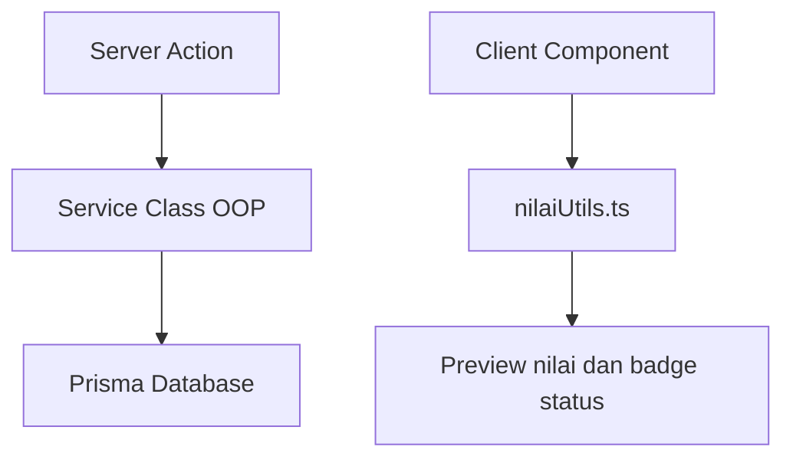

# Penjelasan Fungsi dan Class

## 1. Tujuan Dokumen

Dokumen ini menjelaskan fungsi dan class utama yang digunakan dalam aplikasi. Fokus dokumentasi adalah bukti implementasi OOP dan pemrograman terstruktur untuk kebutuhan Asesor LSP.

File yang dijelaskan:

1. `lib/services/SiswaService.ts`
2. `lib/services/GuruService.ts`
3. `lib/services/NilaiService.ts`
4. `lib/utils/nilaiUtils.ts`

## 2. SiswaService

File:

```text
lib/services/SiswaService.ts
```

Tujuan:

`SiswaService` bertanggung jawab mengelola data siswa, termasuk pembuatan akun user untuk siswa.

Prinsip OOP yang diterapkan:

| Prinsip | Implementasi |
| --- | --- |
| Class | Menggunakan `class SiswaService`. |
| Constructor | Constructor menginisialisasi akses Prisma. |
| Encapsulation | Prisma disimpan sebagai property class. |
| Single Responsibility | Class fokus pada operasi data siswa. |

Method utama:

| Method | Penjelasan |
| --- | --- |
| `tambahSiswa(data)` | Membuat data siswa baru dan akun user dengan role SISWA. Password di-hash sebelum disimpan. |
| `getDaftarSiswa()` | Mengambil semua data siswa untuk tabel Admin. |
| `getSiswaById(id)` | Mengambil detail siswa tertentu berdasarkan ID. |
| `getSiswaByUserId(userId)` | Mengambil data siswa berdasarkan user yang sedang login. |
| `updateSiswa(id, data)` | Mengubah data siswa. |
| `hapusSiswa(id)` | Menghapus siswa dari database. |

Contoh peran dalam alur sistem:

```text
Form Admin -> siswaActions.ts -> new SiswaService() -> tambahSiswa() -> Prisma -> PostgreSQL
```

## 3. GuruService

File:

```text
lib/services/GuruService.ts
```

Tujuan:

`GuruService` bertanggung jawab mengelola data guru, termasuk pembuatan akun user untuk guru.

Prinsip OOP yang diterapkan:

| Prinsip | Implementasi |
| --- | --- |
| Class | Menggunakan `class GuruService`. |
| Constructor | Constructor menginisialisasi akses Prisma. |
| Encapsulation | Akses database berada di dalam class. |
| Single Responsibility | Class fokus pada operasi data guru. |

Method utama:

| Method | Penjelasan |
| --- | --- |
| `tambahGuru(data)` | Membuat data guru baru dan akun user dengan role GURU. |
| `getDaftarGuru()` | Mengambil semua data guru untuk tabel Admin. |
| `getGuruById(id)` | Mengambil detail guru tertentu berdasarkan ID. |
| `getGuruByUserId(userId)` | Mengambil data guru berdasarkan user login. Digunakan pada dashboard dan input nilai guru. |
| `updateGuru(id, data)` | Mengubah data guru. |
| `hapusGuru(id)` | Menghapus guru dari database. |

Contoh peran dalam alur sistem:

```text
Halaman Guru -> auth session userId -> GuruService.getGuruByUserId() -> data guru login
```

## 4. NilaiService

File:

```text
lib/services/NilaiService.ts
```

Tujuan:

`NilaiService` adalah class utama untuk proses pengolahan nilai siswa. Class ini mengelola kalkulasi nilai akhir, penentuan status kelulusan, input nilai, update nilai, dan pengambilan rekap nilai.

Prinsip OOP yang diterapkan:

| Prinsip | Implementasi |
| --- | --- |
| Class | Menggunakan `class NilaiService`. |
| Constructor | Constructor menginisialisasi akses Prisma. |
| Encapsulation | Bobot nilai dan batas lulus disimpan sebagai property private readonly. |
| Behavior | Kalkulasi dan operasi database dikemas dalam method. |
| Cohesion | Semua logika nilai berada dalam satu class yang fokus. |

Konstanta bisnis:

| Konstanta | Nilai | Fungsi |
| --- | --- | --- |
| `BOBOT_TUGAS` | 0.3 | Bobot nilai tugas. |
| `BOBOT_UTS` | 0.3 | Bobot nilai UTS. |
| `BOBOT_UAS` | 0.4 | Bobot nilai UAS. |
| `BATAS_LULUS` | 70 | Ambang batas kelulusan. |

Method utama:

| Method | Penjelasan |
| --- | --- |
| `hitungNilaiAkhir(tugas, uts, uas)` | Menghitung nilai akhir berdasarkan formula 30/30/40. |
| `tentukanStatusKelulusan(nilaiAkhir)` | Menentukan status LULUS atau TIDAK_LULUS. |
| `validasiRentangNilai(nilai)` | Memastikan nilai berada pada rentang 0 sampai 100. |
| `inputNilai(data)` | Menyimpan nilai baru, menghitung nilai akhir, dan menentukan status. |
| `getNilaiBySiswa(siswaId)` | Mengambil nilai milik siswa tertentu. |
| `getNilaiByGuru(guruId)` | Mengambil nilai yang diinput guru tertentu. |
| `getSemuaNilai()` | Mengambil seluruh nilai untuk Admin dan laporan. |
| `updateNilai(id, data)` | Memperbarui nilai dan menghitung ulang nilai akhir serta status. |
| `hapusNilai(id)` | Menghapus data nilai. |

Contoh peran dalam alur sistem:

```text
FormInputNilai -> inputNilaiAction -> new NilaiService() -> inputNilai() -> Prisma -> PostgreSQL
```

## 5. nilaiUtils.ts

File:

```text
lib/utils/nilaiUtils.ts
```

Tujuan:

`nilaiUtils.ts` menyimpan fungsi-fungsi terstruktur yang dapat digunakan ulang di UI dan komponen pendukung.

Fungsi utama:

| Fungsi | Penjelasan |
| --- | --- |
| `hitungNilaiAkhir(nilaiTugas, nilaiUTS, nilaiUAS)` | Menghitung nilai akhir berdasarkan bobot nilai. |
| `tentukanStatusKelulusan(nilaiAkhir)` | Mengembalikan `LULUS` jika nilai akhir minimal 70, selain itu `TIDAK_LULUS`. |
| `validasiRentangNilai(nilai)` | Mengembalikan true jika nilai valid dalam rentang 0 sampai 100. |
| `formatNilai(nilai)` | Memformat nilai agar rapi saat ditampilkan di UI. |
| `getVarianBadgeStatus(status)` | Menentukan variant badge Shadcn berdasarkan status kelulusan. |

## 6. Hubungan OOP dan Terstruktur



Penjelasan:

1. OOP digunakan untuk operasi backend dan database.
2. Pemrograman terstruktur digunakan untuk fungsi kecil yang jelas dan reusable.
3. Keduanya dipisahkan agar kode tidak bercampur dan mudah dijelaskan.

## 7. Kesimpulan

Implementasi class service dan fungsi utilitas sudah memenuhi kebutuhan LSP:

1. Ada tiga class service utama: `SiswaService`, `GuruService`, dan `NilaiService`.
2. Setiap service digunakan melalui instansiasi class.
3. Ada fungsi terstruktur minimal lima fungsi di `nilaiUtils.ts`.
4. Formula nilai dan status kelulusan terpusat sehingga mengurangi duplikasi.
5. Arsitektur mudah dipresentasikan kepada Asesor karena alur tanggung jawab jelas.

